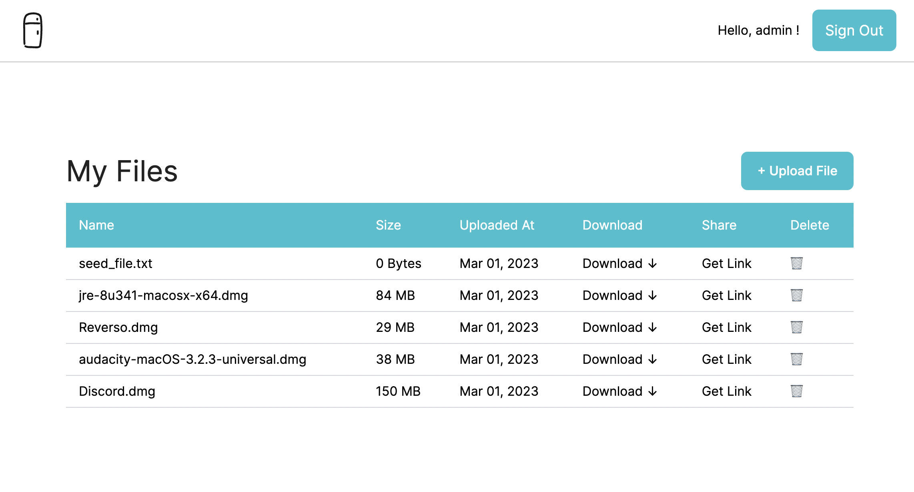

# Filedge

[Demo](https://filedge.onrender.com/)



A simple file-sharing application.

# Environment

| env        | version |
| ---------- | ------- |
| rails      | 7.0.4.2 |
| ruby       | 3.0.3   |
| PostgreSQL | 14.4    |

# Setup

## Docker compose

### Build services

```
bin/rails setup
```

### Start services

```
bin/rails up
```

see tasks/docker/dev.rake for all dev tasks.

Then visit `http://localhost:3000` to access the app.

If make command is unavailable to you, you can also run these manually:

```
docker compose build
docker compose run --rm web bin/rails db:create db:migrate db:seed
docker compose up
```

## Local ruby environment

If you prefer setting up without docker, you can run these commands. Please make sure you have the correct ruby version.

### Install dependencies

```bash
bin/setup
```

### Start the application

```
bin/dev
```

Then visit `http://localhost:3000` to access the app.
