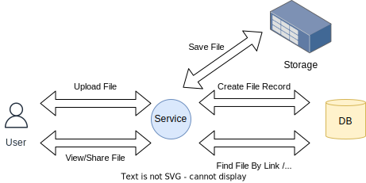
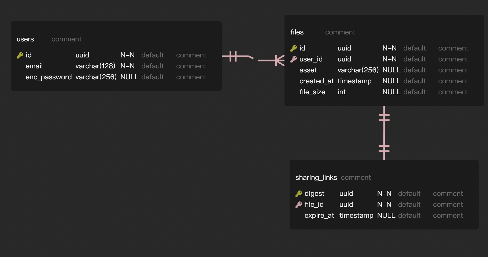
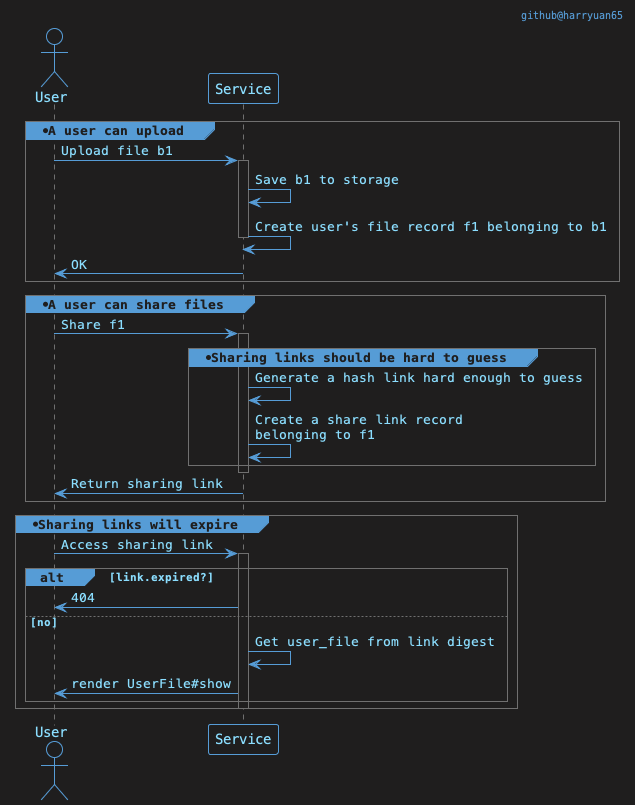

# Part 1 - Application Structure

I would start with this simple structure:

## Domain

- A user can upload files -> a user has many files
- A user can share files -> a file might have a sharing link

- Sharing links should be hard to guess.
  My ideas were:
  - We can try solely using a uuid for `user_files#id`. The `user_files#show` will conveniently be our sharing link. Users who know this URL cannot guess the other ids since it is not sequential.
  - However, because `GET user_files/UUID_GIBBERISH` is also exposing sensitive info, I think it's better to hide information when sharing files. So I planned to generate a unique hash and create the link as `/share/UNIQUE_HASH`. I pick `Digest::SHA256` since - It has tons of possible outputs ($2^{256}$). - It is known to be very unlikely to create duplicated keys. Even when the input change only slightly, the output will change drastically.
    For now, this is my function to generate a random link hash.
    $$\text{digest} = \text{SHA256}(\text{ UserFileId })$$
- Sharing links will expire.
  - Sharing links will have an `expire_at` field.
  - When a user tries to access a link that is expired, he should receive a 404 response.

According to my train of thought, I have:

## General Business Logic

Here is my brief implementation:

## Choices About The Architecture

File upload: I want to make "files" a single model `UserFile` that can be referenced by a `SharingLink`, So I use `carrierwave` instead of `active storage` for this case. Both of them supports uploading to local storage and S3.

Database choice: The models I planned to create have clear schemas and relationships, so I prefer using a sql database. Selecting `PostgresSQL` is because I am more familiar with it.

# Part 2 - Implementation

Please refer to this repository.
